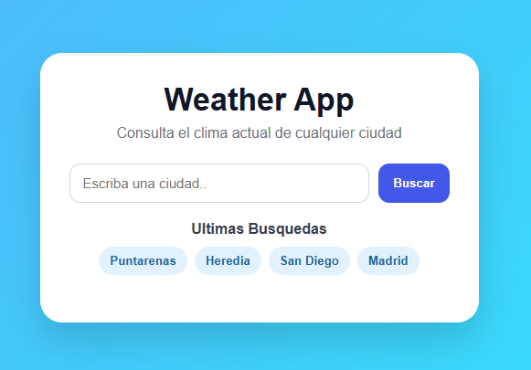
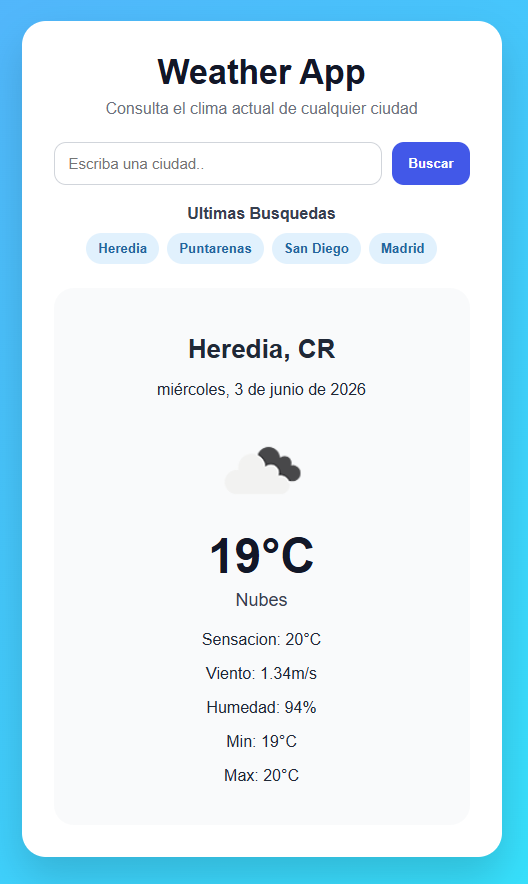

# Weather App React

Aplicación de clima desarrollada con React que consume la API de OpenWeather.

## Características

- Buscar clima por ciudad
- Temperatura actual
- Sensación térmica
- Humedad
- Velocidad del viento
- Temperatura mínima y máxima
- Historial de búsquedas
- Persistencia con LocalStorage
- Manejo de errores

## Tecnologías

- React
- JavaScript
- Vite
- CSS
- OpenWeather API

## Variables de entorno

- Crear archivo .env 

## Screenshots





## Instalación

```bash
npm install
npm run dev


